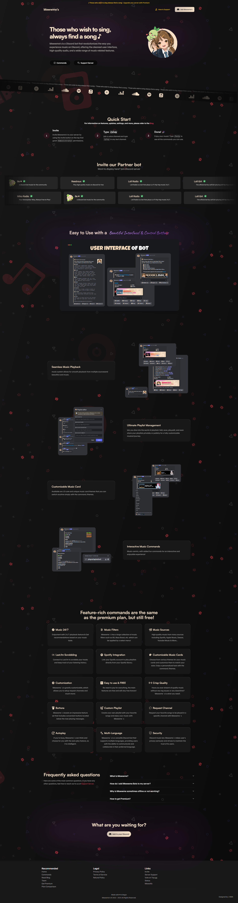

<br />
<p align="center">
  <a href="https://meww.me">
    
  </a>

  <h1 align="center">Mewwme's Website</h1>

  <p align="center">Official website for Mewwme's Discord Music Bot.
    <br />
    <br />
    <a href="https://github.com/lrmn7/mewwme-website/issues">Report Issues & Give Suggestions</a>
    ·
    <a href="https://discord.com/oauth2/authorize?client_id=928711702596423740&permissions=8&scope=bot+applications.commands">Invite</a>
    ·
    <a href="https://discord.gg/6EXgrmtkPX">Support Server</a>
  </p>

## Showcase

<details><summary>Spoiler Page</summary></details>

---

## Getting Started

1. Install dependencies using pnpm:

```bash
pnpm install
```

2. Run the development server:

```bash
pnpm dev
```

Open [http://localhost:3000](http://localhost:3000) with your browser to see the result.

---

## Learn More

To learn more about Next.js, take a look at the following resources:

- [Next.js Documentation](https://nextjs.org/docs) - learn about Next.js features and API.
- [Learn Next.js](https://nextjs.org/learn) - an interactive Next.js tutorial.

You can check out [the Next.js GitHub repository](https://github.com/vercel/next.js/) - your feedback and contributions are welcome!

## Deploy on Vercel

The easiest way to deploy your Next.js app is to use the [Vercel Platform](https://vercel.com/new?utm_medium=default-template&filter=next.js&utm_source=create-next-app&utm_campaign=create-next-app-readme) from the creators of Next.js.

Check out our [Next.js deployment documentation](https://nextjs.org/docs/deployment) for more details.